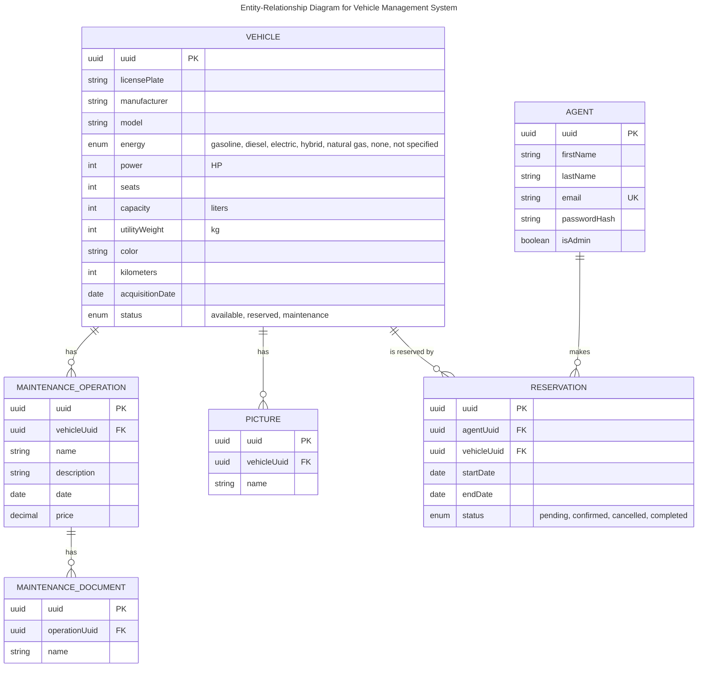

```mermaid
---
title: Entity-Relationship Diagram for Vehicle Management System
---
erDiagram
    VEHICLE ||--o{ MAINTENANCE_OPERATION : has
    VEHICLE ||--o{ PICTURE : has
    VEHICLE ||--o{ RESERVATION : "is reserved by"
    MAINTENANCE_OPERATION ||--o{ MAINTENANCE_DOCUMENT : has
    AGENT ||--o{ RESERVATION : makes
    
    VEHICLE {
        uuid uuid PK
        string licensePlate
        string manufacturer
        string model
        enum energy "gasoline, diesel, electric, hybrid, natural gas, none, not specified"
        int power "HP"
        int seats
        int capacity "liters"
        int utilityWeight "kg"
        string color
        int kilometers
        date acquisitionDate
        enum status "available, reserved, maintenance"
    }
    
    PICTURE {
        uuid uuid PK
        uuid vehicleUuid FK
        string name
    }
    
    MAINTENANCE_OPERATION {
        uuid uuid PK
        uuid vehicleUuid FK
        string name
        string description
        date date
        decimal price
    }
    
    MAINTENANCE_DOCUMENT {
        uuid uuid PK
        uuid operationUuid FK
        string name
    }
    
    AGENT {
        uuid uuid PK
        string firstName
        string lastName
        string email UK
        string passwordHash
        boolean isAdmin
    }
    
    RESERVATION {
        uuid uuid PK
        uuid agentUuid FK
        uuid vehicleUuid FK
        date startDate
        date endDate
        enum status "pending, confirmed, cancelled, completed"
    }
```

