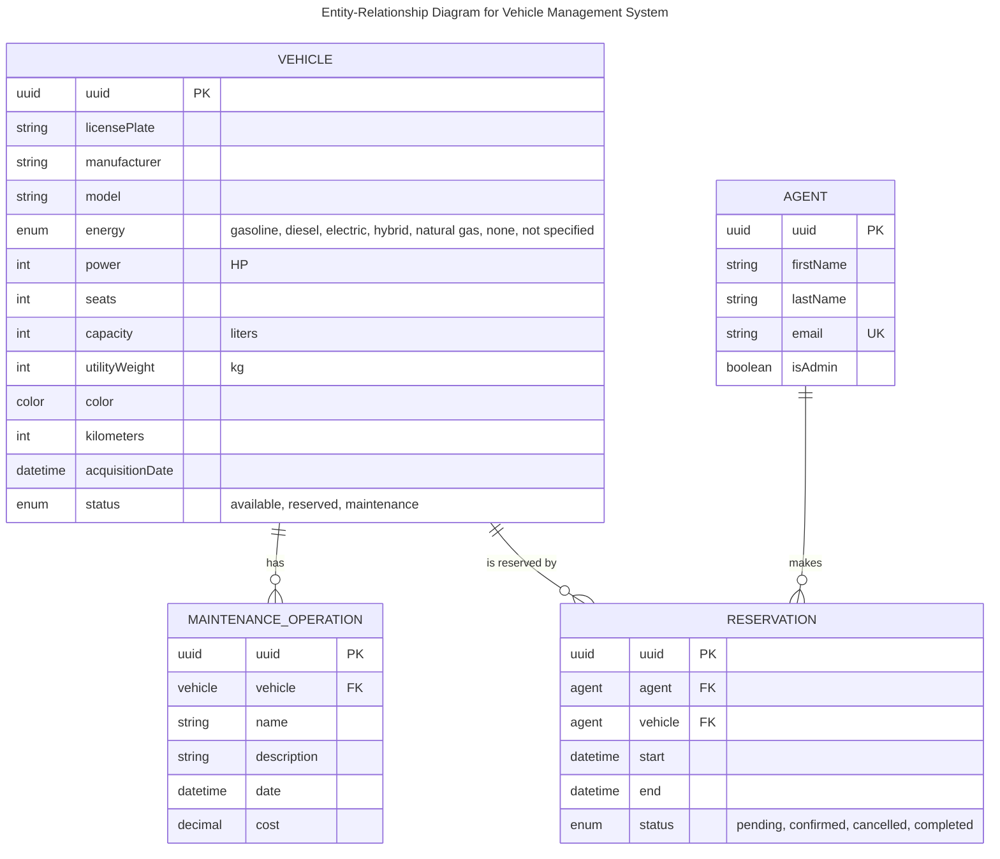

```mermaid
---
title: Entity-Relationship Diagram for Vehicle Management System
---
erDiagram
    VEHICLE ||--o{ MAINTENANCE_OPERATION : has
    VEHICLE ||--o{ RESERVATION : "is reserved by"
    AGENT ||--o{ RESERVATION : makes
    
    VEHICLE {
        uuid uuid PK
        string licensePlate
        string manufacturer
        string model
        enum energy "gasoline, diesel, electric, hybrid, natural gas, none, not specified"
        int power "HP"
        int seats
        int capacity "liters"
        int utilityWeight "kg"
        color color
        int kilometers
        datetime acquisitionDate
        enum status "available, reserved, maintenance"
    }
    
    MAINTENANCE_OPERATION {
        uuid uuid PK
        vehicle vehicle FK
        string name
        string description
        datetime date
        decimal cost
    }
    
    AGENT {
        uuid uuid PK
        string firstName
        string lastName
        string email UK
        boolean isAdmin
    }
    
    RESERVATION {
        uuid uuid PK
        agent agent FK
        agent vehicle FK
        datetime start
        datetime end
        enum status "pending, confirmed, cancelled, completed"
    }
```

